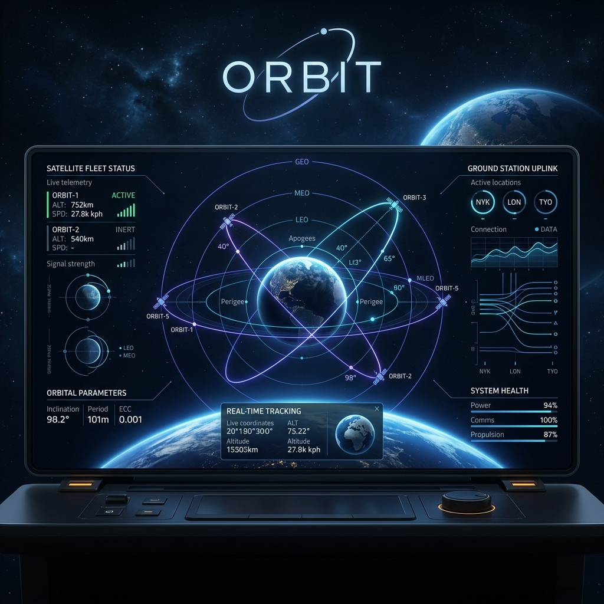

# Orbit: Autonomous Development Orchestrator



## 🌌 概要 (Overview)

**Orbit** は、自律型AIエージェント（AntiGravity）のための**統合管制室（Command Center）**です。
高度なオーケストレーション機能、厳格なデータ・ガバナンス、そしてリアルタイムのテレメトリ監視を組み合わせ、複雑なソフトウェア開発プロセスをAIが自律的に遂行・管理するためのハブとして機能します。

> [!IMPORTANT]
> **本プロジェクトは、「AIエージェントの開発支援としてのソフトウェア開発テスト」の一環として開発・公開されています。**
> Orbit は、AI エージェントが実際の開発環境（ファイルシステム、ビルドツール、デバッグログ等）と対話し、自律的にプロダクトを完成させるプロセスを「オーケストレート（指揮）」するための基盤ソフトウェアです。

### 🚀 開発テスト・ショーケース (Showcase)
Orbit（および AntiGravity エージェント）によって自律的に開発されたプロダクトの例です。
- [Puzzle Collection](https://github.com/k1031oct/Puzzle.git) (15 Puzzle, 2048, Minesweeper, Sudoku)
- [Memo App](https://github.com/k1031oct/Memo.git)
- [Schedule App](https://github.com/k1031oct/Schedule.git)
- [WeatherNote](https://github.com/k1031oct/WeatherNote.git)
- [All-In-One Notebook](https://github.com/k1031oct/All-In-One-Notebook.git)
- [Notebook for Android](https://github.com/k1031oct/Notebook-for-Android.git)

---

## 🚀 主要機能 (Key Features)

### 1. 📂 Local-First Command Center
- すべてのプロジェクトデータと要件定義は、ローカルの SQLite (`orbit.db`) を **Source of Truth** として管理されます。
- 高速なアクセスと、ネットワーク環境に左右されない安定した開発体験を提供します。

### 2. 🤖 MCP (Model Context Protocol) Integration
- 内蔵の MCP エンドポイントにより、AIエージェントは Orbit を通じて物理ファイル、データベース、さらにはシェルコマンドに安全にアクセスできます。

### 3. ⚖️ 開発ガバナンスの物理強制 (Governance Enforcement)
- `write_governed_file` などのツールを通じて、プロジェクト固有の規約（例：Compose-only, MVVM パターン）をエンジニアリングレベルで強制します。
- 命名規則や禁止ライブラリ（XML 等）を AI が自動検知し、不整合な書き込みを物理的にブロックします。

### 4. 🛠️ 自律修復ループ & 物理監査 (Self-Healing & Audit)
- **ビルド修復 2.0 (Local AI 統合)**: 内蔵された **Gemma 2-2B** がビルドログをリアルタイムで解析。エラーの根本原因を特定し、修正案を提示します。
- **物理監査 (Physical Audit)**: エミュレータや実機から **UI XML ダンプ** および **スクリーンショット** を自動取得。Vision モデルと連携し、レンダリング結果の整合性を視覚的に検証可能です。
- **テレメトリ**: すべての「意思決定（Decision）」とその「理由（Reasoning）」を SQLite に永続化し、開発プロセスの透明性を担保します。

### 5. 🖥️ Tactical Console (v2.0)
- 漆黒の Cyber-Glass デザインを採用した、高精度通信コンソール。
- **Smart Auto-Scroll**: 通信量の多いビルドログでも、最新のステータスを自動検知して追従。
- **Visual ANSI**: [ERROR] や [SUCCESS]、[INTERNAL_AI] などの特定信号を色付けし、情報の重要度を瞬時に判別可能。

---

## 🏗️ 技術スタック (Technology Stack)

| Layer | Technology |
| :--- | :--- |
| **Framework** | [Tauri v2](https://v2.tauri.app/) (Next.js 15 Integration) |
| **Frontend** | React 19 / TypeScript / Lucide-React |
| **Backend (Native)** | Rust (Tauri Commands) |
| **Database** | SQLite ([sql.js](https://sql.js.org/)) |
| **AI Interface** | Model Context Protocol (MCP) |
| **Local LLM** | Gemma 2 2B (GGUF) via llama.cpp Sidecar |

### アーキテクチャ
- **View-ViewModel-Repository パターン**を厳守し、UI、ロジック、データアクセスを完全に分離。
- Rust によるネイティブレイヤーを活用し、OSレベルのセキュアな操作を実現。

---

## 🛠️ セットアップ (Getting Started)

### 前提条件
- Node.js (v20以上)
- Rust (最新の stable)
- Windows OS (Tauri v2 サポート環境)

### インストール & 起動
```bash
# 依存関係のインストール
npm install

# 開発モード (Next.js + Tauri) で起動
npm run dev

# Tauri コマンドの単体実行
npm run tauri dev
```

---

## 📜 開発憲法 (Governance)

Orbit プロジェクトにおける変更は、常に `DATA_FLOW.md` の定義に基づかなければなりません。
実装がドキュメントと矛盾する場合、まずドキュメントを更新し、承認を得る必要があります。

- **Telemetry Duty**: 重大な例外処理では必ず `LogRepository` に記録すること。
- **Clean Binding**: 直接的な DOM 操作を避け、ViewModel 経由で状態を管理すること。

---

## 🛰️ リンク
- [開発ワークフロー (ORBIT_DEV_WORKFLOW.md)](ORBIT_DEV_WORKFLOW.md)
- [データフロー定義 (DATA_FLOW.md)](DATA_FLOW.md)

---
*Developed by **AntiGravity** - Empowering Autonomous Development.*
